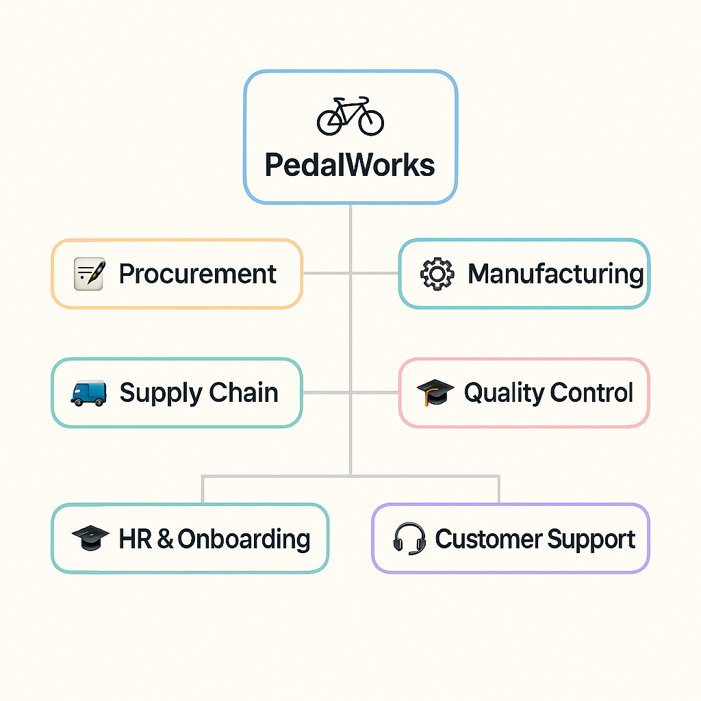

# 
🚴‍♀️ **Beam: Invent the Future of Work with Intelligent Agents** 🚀

## 
📣 Case Introduction

AI-driven automation is reshaping how enterprises operate — unlocking opportunities at the intersection of innovation and efficiency.

**Your mission:** Use Beam’s no-code AI Agent platform to create a transformative solution for **PedalWorks**, a fictional bicycle manufacturing company.

### 🛠 What You Can Do:

* Target a workflow or department at PedalWorks where intelligent agents could drive massive value.
* Design and prototype AI agents that automate, streamline, or reinvent real business processes.
* Explore new modalities — integrate voice for natural interaction or use Beam’s APIs to build custom interfaces with tools like Loveable.

We'll provide platform access and starter examples — you bring the ideas.

Think you’ve got what it takes? Show us your vision at the hackathon. 🧠⚡

---

## 
📊 The Pitch

  <em>
    <a href="https://docs.google.com/presentation/d/1rcZP8vnT2lSsNStOSm3ppXShRl32hN5W1uVlZi8lpvM/edit?usp=sharing" target="_blank">
      Pitch
    </a>
  </em>

---

## 
🔬 Deep Dive Slides

<em>Insert Deep Dive Slides Here</em>

---

## 
🚲 Use Case: Meet PedalWorks

**PedalWorks** is a mid-sized bike manufacturer operating across four locations with approximately 500 employees. The company spans six core departments:

* Procurement
* Manufacturing
* Quality Control
* Supply Chain
* HR & Onboarding
* Customer Support

Each team struggles with **repetitive, low-value tasks** that hamper productivity, increase errors, and reduce strategic focus.

### 🎯 Your Challenge:

Pick a real-world problem in any department, and demonstrate how your agent can:

* Automate with Intelligence: Deliver a working, end-to-end workflow powered by Beam.
* Deliver Tangible Impact: Quantify gains — hours saved, errors reduced, or satisfaction improved.
* Integrate Seamlessly: Show how your agent fits into existing tools and processes.

---

## 🧩 Department Overview + Jobs to Be Done

| **Department**       | **Challenges**                                                                                                                                                      | **Jobs to Be Done (JTBD)**                                                                                                                                                                                 |
| -------------------- | ------------------------------------------------------------------------------------------------------------------------------------------------------------------- | ---------------------------------------------------------------------------------------------------------------------------------------------------------------------------------------------------------- |
| **Procurement**      | - Manual vendor onboarding and contract reviews delay operations.   - Invoice-to-PO matching is error-prone.   - Payment processes create bottlenecks.        | - Rapidly onboard vendors and validate contracts with minimal back-and-forth.   - Reconcile POs and invoices accurately with minimal effort.   - Ensure timely payments and maintain supplier trust. |
| **Manufacturing**    | - Delayed maintenance alerts lead to downtime.   - Manual schedule recalculations during demand spikes.   - Workforce planning relies on static spreadsheets. | - Act on real-time alerts to prevent equipment failure.   - Dynamically adjust production schedules based on live inputs.   - Optimize staffing using real-time insights.                            |
| **Quality Control**  | - Backlogs delay product release.   - Inconsistent defect tracking limits root-cause analysis.                                                                   | - Accelerate inspections and reduce bottlenecks.   - Standardize defect logging to enable actionable trend analysis.                                                                                    |
| **Supply Chain**     | - Poor inventory visibility causes stockouts/overstock.   - Forecasting is fragmented and unreliable.                                                            | - Gain real-time visibility across inventory systems.   - Generate accurate demand forecasts with integrated data.                                                                                      |
| **HR & Onboarding**  | - New-hire paperwork takes days via email.   - Training compliance is manually tracked.   - Resume screening is inefficient.                                  | - Automate onboarding workflows to reduce ramp time.   - Track certifications centrally.   - Use intelligent filters to shortlist candidates quickly.                                                |
| **Customer Support** | - Requests arrive unstructured, requiring manual parsing.   - Customer data is spread across tools.   - Claim tracking is manual and error-prone.             | - Convert support requests into structured formats automatically.   - Give agents full visibility into customer history.   - Track and manage claims in a centralized, reliable system.              |

---

## 
📚 Resources

### **📁 Data**

You'll have access to curated datasets, including:

* **Source-to-Pay** data from Celonis
* **Order Processing** data from Beam

Want to solve a new problem? Go for it! Use our:

* **Dataset Generation Helper** – Upload a single example (PDF, JSON, etc.), and generate multiple variations for testing your agent effectively.

### **⚙️ Technology**

You’ll get full access to:

* [**Beam AI Platform**](https://app.beam.ai/) – A powerful low-code agent builder, featuring:

  * **Flow Builder:** Map out workflows visually.
  * **Integration & Tool Builder:** Hook into APIs and external systems.
  * **Tool Tuner:** Improve accuracy and performance.
  * **Human-in-the-Loop:** Add approval or feedback steps.
  * **Agent Analytics:** Track behavior, performance, and usage.

### **✨ Optional Enhancements**

* **Loveable Frontend Builder** (credits provided) for custom UI design.
* **Beam APIs** to embed agents into web/mobile apps.

  * API docs and sample apps will be shared for guidance.

---

## 
🧠 Judging Criteria

Your submission will be evaluated across the following five dimensions. Winning teams will excel not only in innovation, but also in execution, impact, and storytelling.

| **Criteria**                         | **What We’re Looking For**                                                                                                                                                                                |
| ------------------------------------ | --------------------------------------------------------------------------------------------------------------------------------------------------------------------------------------------------------- |
| **1. Use Case Relevance**            | How well does the solution align with real-world challenges faced by PedalWorks?   Did the team pick a meaningful problem and clearly articulate the pain point?                                       |
| **2. Workflow Design & Agent Logic** | Does the agent demonstrate a thoughtful, end-to-end process?   Are flows well-structured, modular, and effectively using Beam’s platform features? |
| **3. Technical Integration**         | How seamlessly does the solution integrate with other tools, datasets, or UIs (via Beam APIs or Loveable)?   Did the team go beyond Beam basics to build robust systems?                               |
| **4. Business & Operational Impact** | What measurable value could this solution deliver (e.g., time saved, errors reduced, faster onboarding, better forecasting)?   Is the impact clearly demonstrated or well-reasoned?                    |
| **5. Presentation & Storytelling**   | Was the final demo compelling, clear, and easy to follow?   Did the team communicate their agent’s purpose, design, and impact effectively — both visually and verbally?                               |

---

### 🏅 Bonus Points

Earn extra credit for:

* Creative use of voice, natural language interfaces, or multimodal interactions
* Innovative use of the Dataset Generator or augmentation techniques
* Embedding the agent into a polished UI using Loveable or Beam APIs

---

## 
📬 Point of Contact

Questions? Reach out to Burak, Mujtaba, or Aqib during the Deep Dive — or ping us anytime on Discord!

---

## 
🏆 Prizes

### Grand Prize 🥇

* **JBL Charge 5 Bluetooth Speaker**
* **1:1 Mentorship Session** with Beam Leadership
